# Essential Linux Commands

## Table of Contents

- [Essential Linux Commands](#essential-linux-commands)
  - [Objective](#objective)
- [1. Basic Commands](#1-basic-commands)
  - [1.1 Navigation and File Operations](#11-navigation-and-file-operations)
    - [i. 'pwd' Command - Print Working Directory](#i-pwd-command---print-working-directory)
    - [ii. 'ls' Command - List directory contents](#ii-ls-command---list-directory-contents)
    - [iii. 'cd' Command - Change directory](#iii-cd-command---change-directory)
    - [iv. 'cp' Command - Copy files or directories](#iv-cp-command---copy-files-or-directories)
    - [v. 'mv' Command - Move/rename files or directories](#v-mv-command---move-or-rename-files-or-directories)
    - [vi. 'rm' Command - Remove files or directories](#vi-rm-command---remove-files-or-directories)
    - [vii. 'mkdir' Command - Create a new directory](#vii-mkdir-command---create-a-new-directory)
    - [viii. 'touch' Command - Create an empty file or update the timestamp](#viii-touch-command---create-an-empty-file-or-update-the-timestamp)
  - [1.2 Viewing and Editing Files](#12-viewing-and-editing-files)
    - [i. 'cat' Command - Concatenate and display file content](#i-cat-command---concatenate-and-display-file-content)
    - [ii. 'more' Command - View file content interactively](#ii-more-command---view-file-content-interactively)
    - [iii. 'less' Command - View file content interactively with more options](#iii-less-command---view-file-content-interactively-with-more-options)
    - [iv. 'head' Command - View the first few lines of a file](#iv-head-command---view-the-first-few-lines-of-a-file)
    - [v. 'tail' Command - View the last few lines of a file](#v-tail-command---view-the-last-few-lines-of-a-file)
    - [vi. 'Nano' & 'vi' - Simple text editors](#vi-nano-and-vi---simple-text-editors)
- [2. Intermediate Commands](#2-intermediate-commands)
  - [2.1 File Permissions and Ownership](#21-file-permissions-and-ownership)
    - [i. 'chmod' Command - Change file modes or Access Control Lists](#i-chmod-command---change-file-modes-or-access-control-lists)
    - [ii. 'chown' Command - Change file owner and group](#ii-chown-command---change-file-owner-and-group)
    - [iii. 'chgrp' Command - Change group ownership](#iii-chgrp-command---change-group-ownership)
  - [2.2 Searching and Finding Files](#22-searching-and-finding-files)
    - [i. 'find' Command - Search for files in a directory hierarchy](#i-find-command---search-for-files-in-a-directory-hierarchy)
    - [ii. 'grep' Command - Search text using patterns](#ii-grep-command---search-text-using-patterns)
    - [iii. 'locate' Command - Find files by name](#iii-locate-command---find-files-by-name)
- [3. System Administration](#3-system-administration)
  - [3.1 'sudo' Command - Execute a command as another user](#31-sudo-command---execute-a-command-as-another-user)
    - [i. Running a Command as Root](#i-running-a-command-as-root)
    - [ii. Running a Command as a Specific User](#ii-running-a-command-as-a-specific-user)

## Objective
This documentation manual aims to offer a step-by-step guide on basic Linux commands for users to master a skillset for effective and productive use of the Linux environment. It covers file management, navigation, text editing, and system administration tasks, introducing basic to intermediate commands with explanations, syntax examples, and use cases to enhance your competence in system management using the Linux command line.

# 1. Basic Commands
## 1.1 Navigation and File Operations
Navigation and file operations in Linux involve a set of essential commands that allow users to interact with the filesystem.

### i. 'pwd' Command - Print Working Directory
The `pwd` command displays the current directory's full path.

Syntax: `pwd`

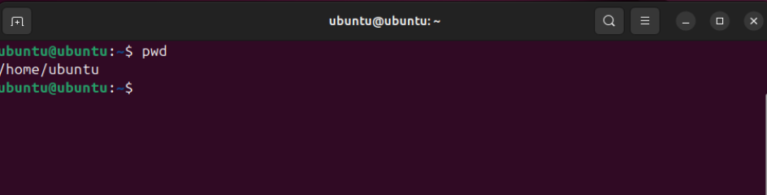

### ii. 'ls' Command - List directory contents
The `ls` command lists files and directories in the current directory.

Syntax: `ls`

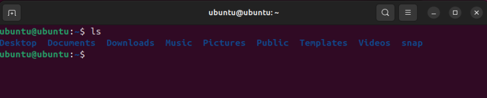

For example, `ls -a` displays all files, including hidden ones.

Syntax: `ls -a`

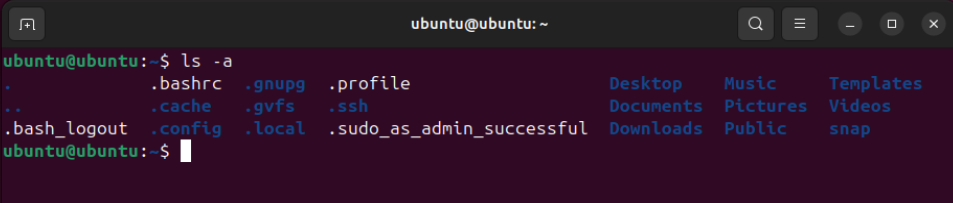

### iii. 'cd' Command - Change directory
The `cd` command allows users to switch directories. If no directory is specified, it defaults to the user's home directory.

Syntax: `cd [directory]`

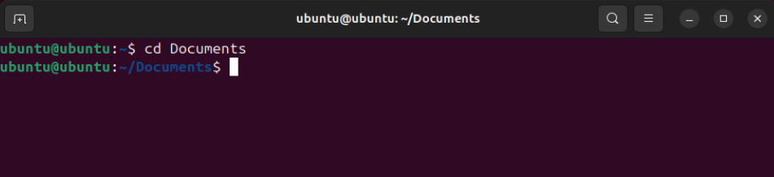

### iv. 'cp' Command - Copy files or directories
The `cp` command copies files or directories to a specified location, useful for creating backups or duplicating data.

Syntax: `cp [option] source destination`

Example: `cp filename.txt /path/to/destination/`

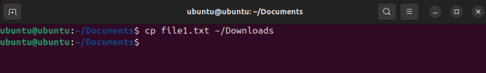

To confirm the file was copied, use the `cd` command to navigate to the destination directory and list the contents with `ls`.

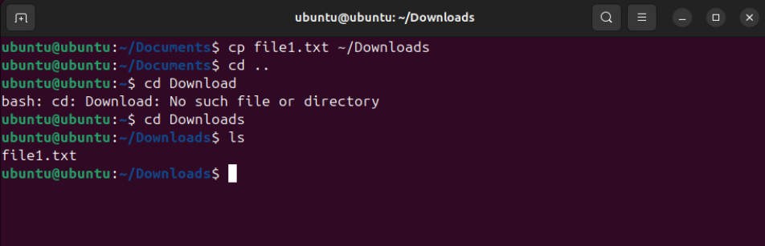

### v. 'mv' Command - Move/rename files or directories
The `mv` command moves or renames files and directories. If the destination exists, it will be overwritten.

Syntax: `mv [options] source destination`

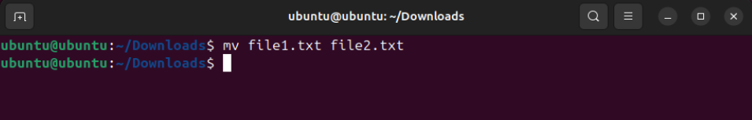

Use the `ls` command to verify the `mv` command operation.

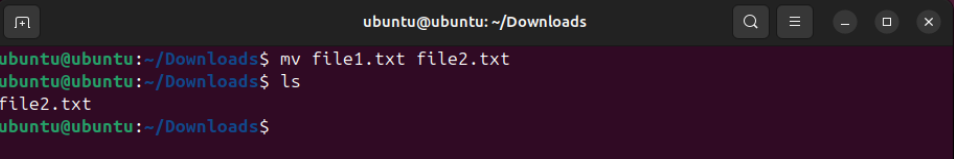

### vi. 'rm' Command - Remove files or directories
The `rm` command deletes files or directories. Multiple files can be removed simultaneously.

Syntax: `rm [options] file(s)`

To remove a single file:
`rm filename.txt`

To remove multiple files:
`rm file1.txt file2.txt file3.txt`

To remove a directory:
`rm -r directoryname`

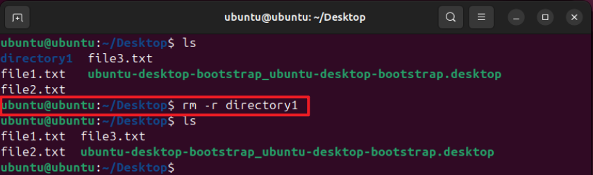

To force remove a file or directory without prompting for confirmation:
`rm -f filename.txt`

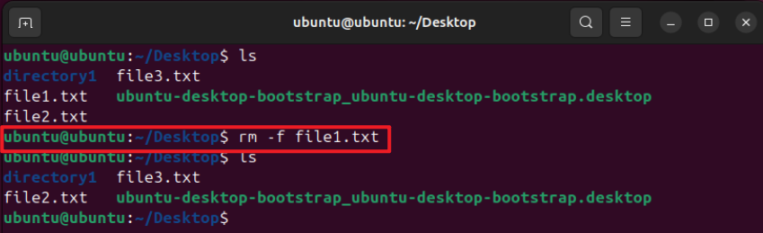

To force remove a directory and its contents without prompting for confirmation:
`rm -rf directoryname`

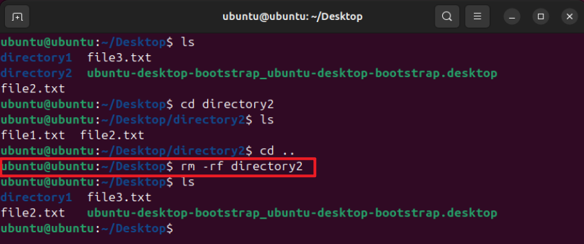

### vii. 'mkdir' Command - Create a new directory
The `mkdir` command creates new directories. Multiple directories can be created simultaneously.

Syntax: `mkdir directory.name`

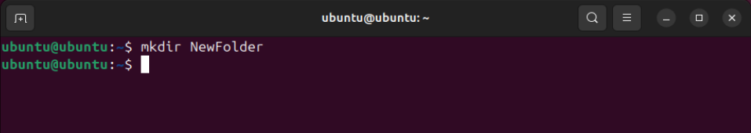

Use the `ls` command to verify the `mkdir` command operation.

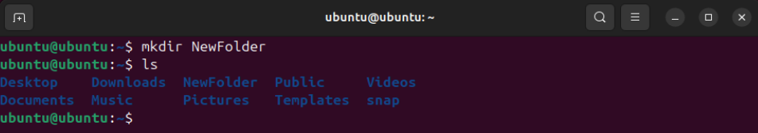

### viii. 'touch' Command - Create an empty file or update the timestamp
The `touch` command creates an empty file or updates the timestamp of an existing file.

Syntax: `touch file.name`

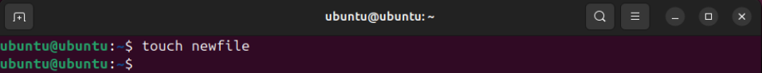

Use the `ls` command to verify the `touch` command operation.

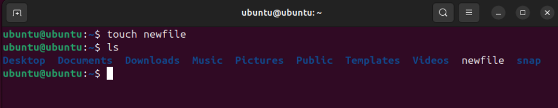

## 1.2 Viewing and Editing Files
Linux offers various commands and text editors to view and edit files. Commands like `cat`, `more`, `less`, `head`, and `tail` are useful for viewing file contents, while `nano` and `vi` are popular text editors for making changes.

### i. 'cat' Command - Concatenate and display file content
The `cat` command reads, combines, and displays file contents.

Syntax: `cat filename.txt`

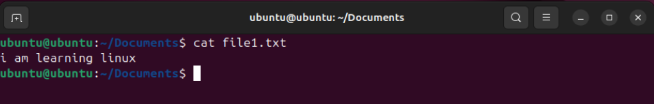

### ii. 'more' Command - View file content interactively
The `more` command displays the contents of a file one screen at a time. It’s useful for large files.

Syntax: `more filename.txt`

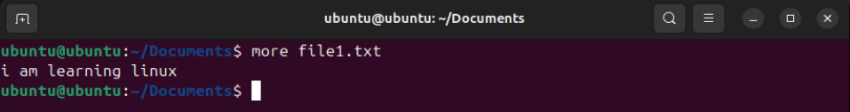

Using `more` with a large file:

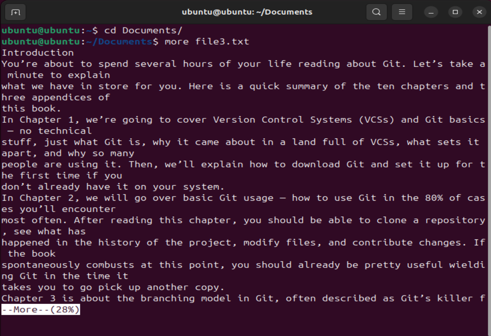

**Key Navigation for `more` command:**
- Press `Space` to move to the next page.
- Press `Enter` to move to the next line.
- Press `b` to move back one page.
- Press `q` to quit the `more` viewer.

### iii. 'less' Command - View file content interactively with more options
The `less` command allows both forward and backward navigation through a file with advanced features.

Syntax: `less filename.txt`

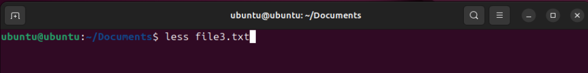
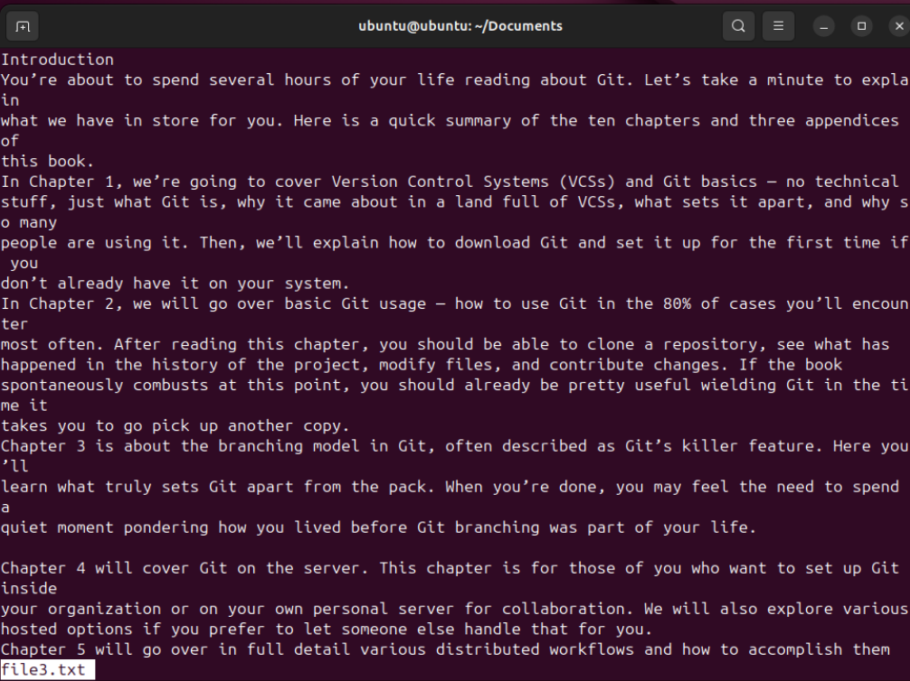

**Key Navigation for `less` command:**
- `Space` or `f` to move forward one page.
- `b` to move backward one page.
- `Enter` to move forward one line.
- `y` to move backward one line.
- `n` to repeat the last search forward.
- `N` to repeat the last search backward.
- `q` to quit the viewer.

### iv. 'head' Command - View the first few lines of a file
The `head` command shows the beginning of a file. By default, it displays the first 10 lines.

Syntax: `head filename.txt`

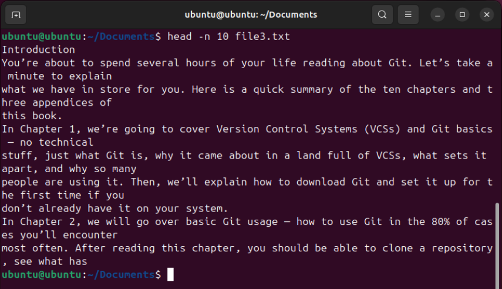

To view a specific number of lines, use `-n` followed by the number of lines:

Syntax: `head -n 20 filename.txt`

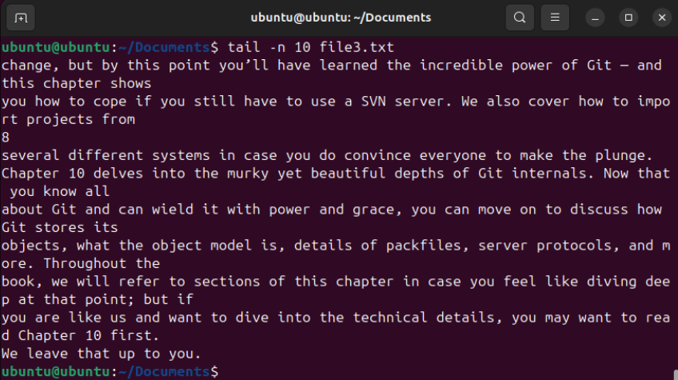

### v. 'tail' Command - View the last few lines of a file
The `tail` command shows the end of a file. By default, it displays the last 10 lines.

Syntax: `tail filename.txt`

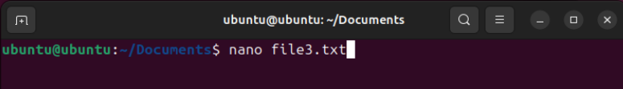

To view a specific number of lines, use `-n` followed by the number of lines:

Syntax: `tail -n 20 filename.txt`

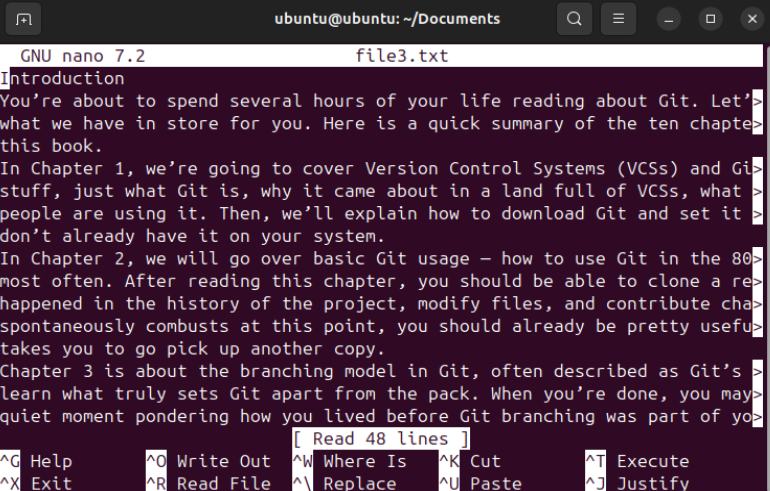

### vi. 'Nano' & 'vi' - Simple text editors
Both `nano` and `vi` are text editors for editing files directly from the terminal.

#### Nano:
To open a file with `nano`, use:

Syntax: `nano filename.txt`

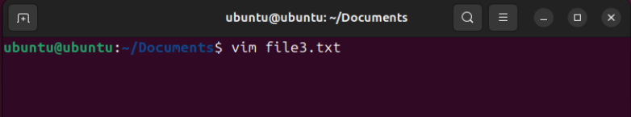

#### vi:
To open a file with `vi`, use:

Syntax: `vi filename.txt`

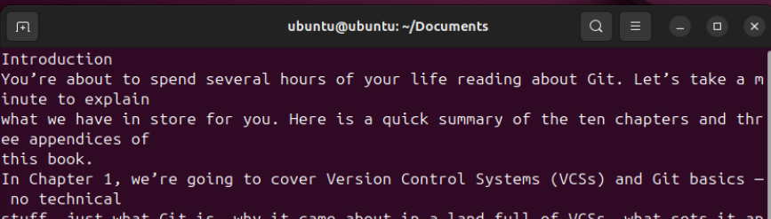

## 2. Intermediate Commands
### 2.1 File Permissions and Ownership
File permissions and ownership in Linux are crucial for controlling access and security.

### i. 'chmod' Command - Change file modes or Access Control Lists
The `chmod` command changes the permissions of a file or directory.

Syntax: `chmod [options] mode file`

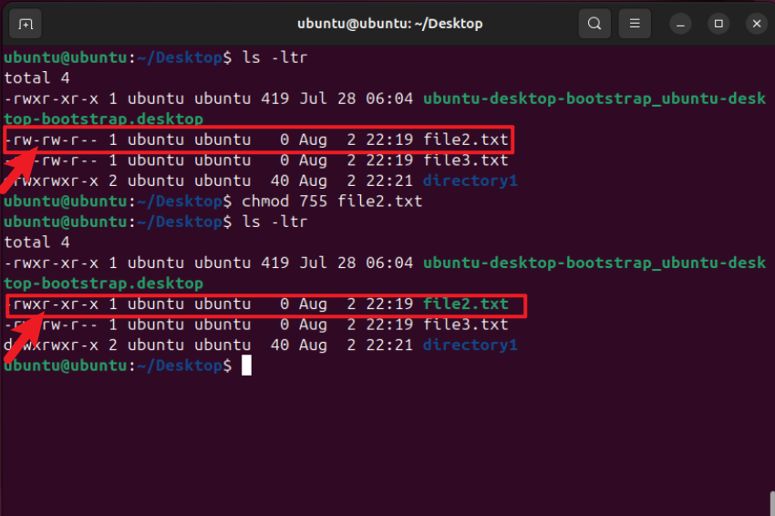

### ii. 'chown' Command - Change file owner and group
The `chown` command changes the owner and group of a file or directory.

Syntax: `chown [owner][:group] file`

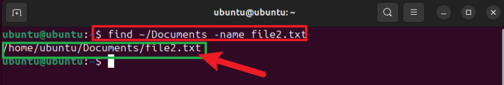

### iii. 'chgrp' Command - Change group ownership
The `chgrp` command changes the group ownership of a file or directory.

Syntax: `chgrp group file`

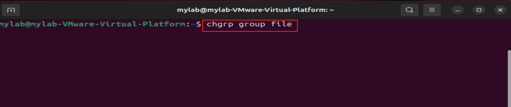

## 2.2 Searching and Finding Files
Finding and searching for files efficiently can be achieved using commands like `find`, `grep`, and `locate`.

### i. 'find' Command - Search for files in a directory hierarchy
The `find` command searches for files in a directory hierarchy.

Syntax: `find [path] [expression]`

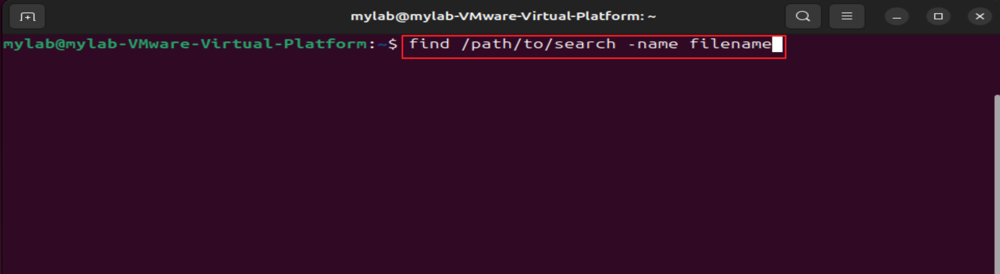

### ii. 'grep' Command - Search text using patterns
The `grep` command searches for patterns within files.

Syntax: `grep [options] pattern file`

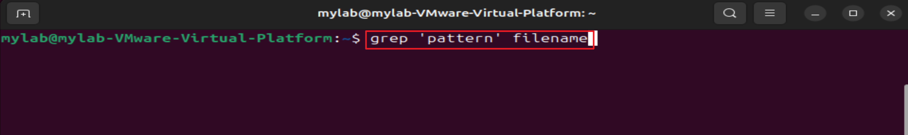

### iii. 'locate' Command - Find files by name
The `locate` command quickly finds files by name using a database.

Syntax: `locate filename`

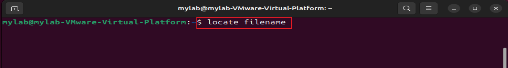

## 3. System Administration
### 3.1 'sudo' Command - Execute a command as another user
The `sudo` command allows users to execute commands with superuser or another user’s privileges.

#### i. Running a Command as Root
To run a command as the root user, prepend `sudo`:

Syntax: `sudo command`

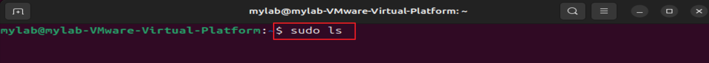

#### ii. Running a Command as a Specific User
To run a command as a specific user:

Syntax: `sudo -u username command`

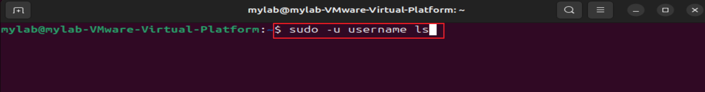
